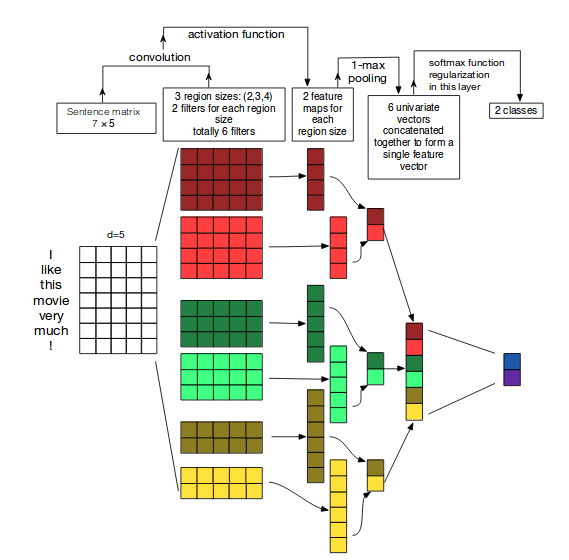

# TextCNN Model
This is the implementation of Convolutional Neural Network for text classification as proposed in the paper [Convolutional Neural Networks for Sentence Classification](https://arxiv.org/abs/1408.5882)

CNN has a lot of success applications in the field of Computer Vision. CNNs have recently been successfully applied to NLP problems as well. Text classification is one such problem.

## Model Architecture

## Implementation Details
- Since sentence lengths vary for different sentences, zero pad/truncate each sentence to have length n
- Represent every sentence/text by a 2D tensor of shape (n,d), where d is dimensionality of word vectors
- Used word2vec Embeddings for encoding words
- Used 4 different filter windows of sizes 2,3,4,5
- Used 300 feature maps for above windows sizes
-  activaion function
- Max-pooling
- Dropout with keep probability 0.7
- Optimizer - Adam
- Loss function - CrossEntropyLoss
