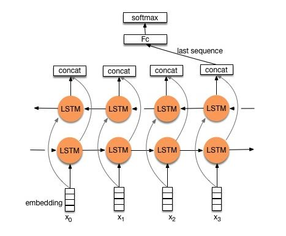

# BiLSTM Model
Here, we have implemented a Bi-directional Long Short Term Memory network in PyTorch.

LSTMs have been very popular for solving text classification problems due to their theoretical property to capture the entire context while representing a sentence.

## Model Architecture
The architecture of Bi-directional LSTM is as follows:

## Implementation Details
- Used pre-trained Glove Embeddings for initializing word vectors
- 2 Layers of BiLSTM
- Used  hidden units within each BiLSTM layer
- Dropout with keep probability 0.3
- Optimizer - Adam
- Loss function - CrossEntropyLoss
- Experimented with flexible sequence lengths and sequences of length 128
